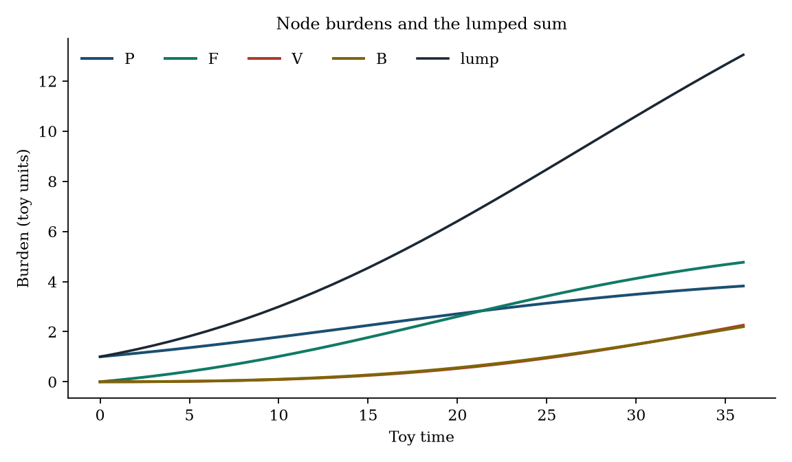
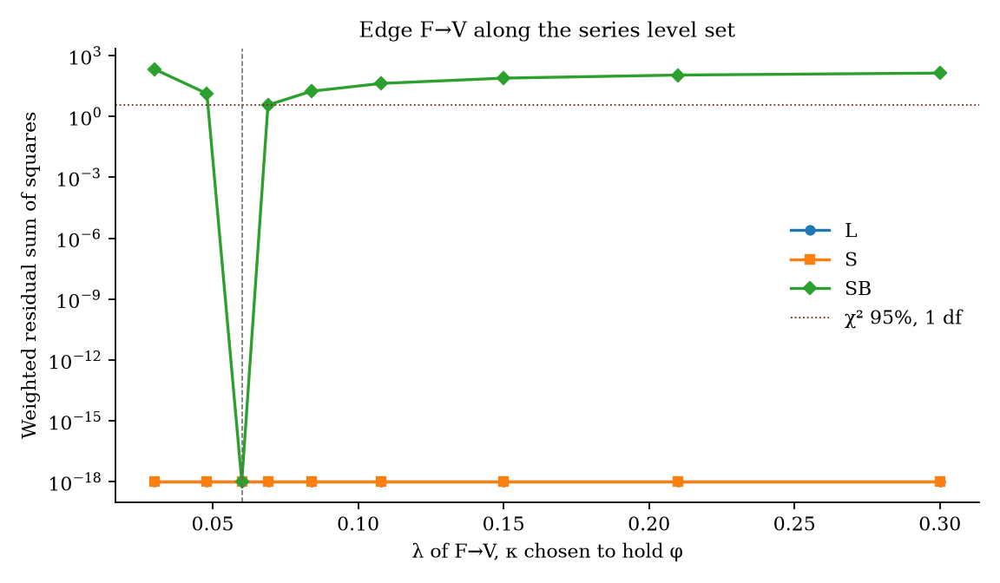
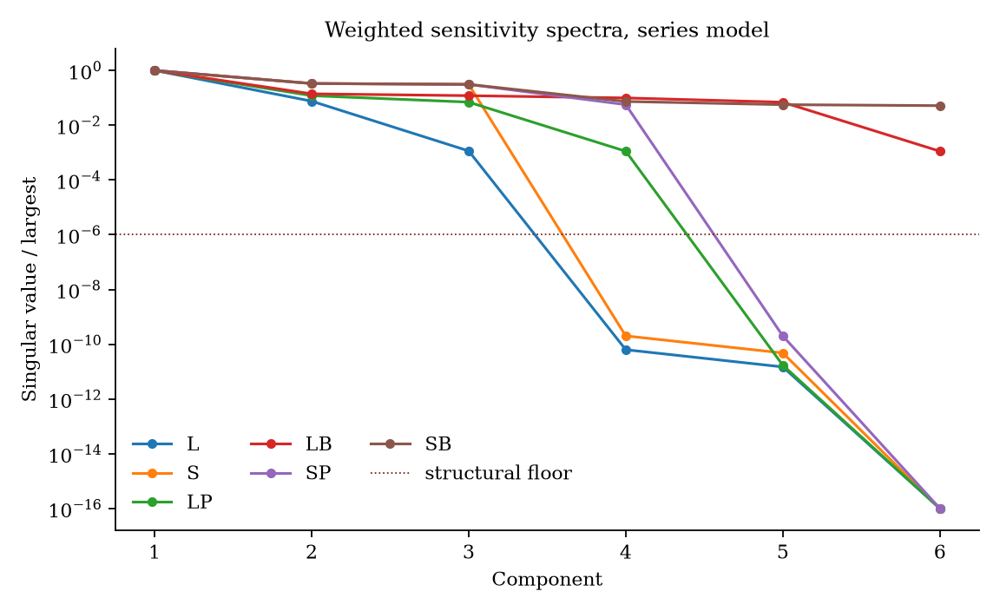
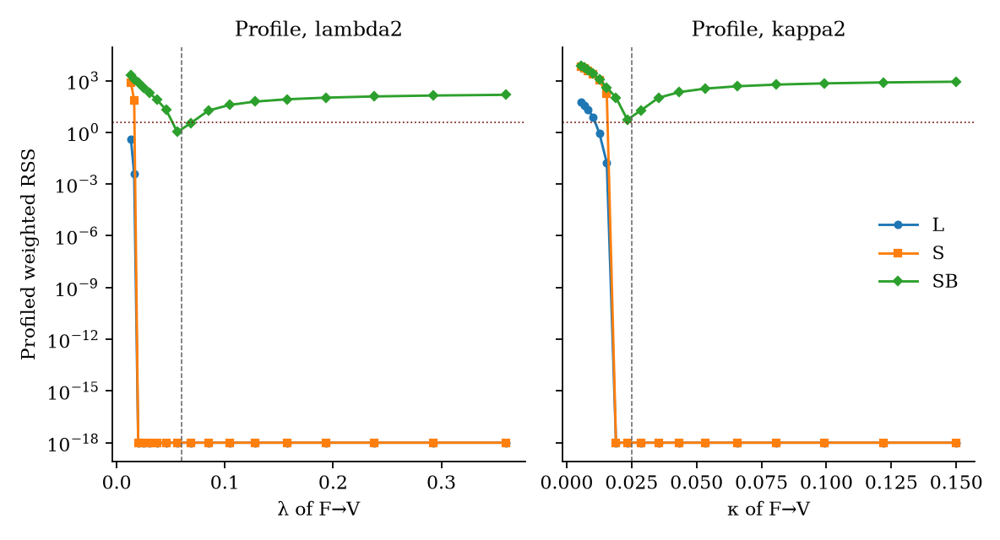

# Anatomical metastasis graphs with edge-wise desmoplastic conductances: lumped burden and edge-rate identifiability

**Thesis #21. Computational research thesis**  
**Author:** Kelechi Emeka Ogbonna  
**Correspondence:** kelechiogbonna300@gmail.com · https://github.com/cloudynirvana/thesis-21-metastasis-graph-barrier-conductances  
**Date:** 21 September 2026  
**Format:** B.Sc. project chapters (Nile University style), written as a computational methods manuscript  
**Depends on:** Thesis #5 (metastasis as a stochastic process on anatomical graphs) and Thesis #11 (desmoplastic transport versus a lumped burden equation)  
**Status:** Definitions, propositions, and a seeded numerical laboratory on a declared toy graph. Not a measurement of metastasis.  
**Citation style:** numbered Vancouver. A `doi:` field appears only where Crossref returned the record.  
**DOI:** none for this document. Do not invent one.

---

## Title page

**ANATOMICAL METASTASIS GRAPHS WITH EDGE-WISE DESMOPLASTIC CONDUCTANCES: LUMPED BURDEN AND EDGE-RATE IDENTIFIABILITY**

BY

**KELECHI EMEKA OGBONNA**

A COMPUTATIONAL RESEARCH THESIS  
(IN-SILICO IDENTIFIABILITY ON A TOY ORGAN GRAPH)

SUBMITTED AS A CITEABLE MANUSCRIPT FOR JOURNAL / THESIS HANDOFF

PROJECT CONFLUENCE  
INDEPENDENT COMPUTATIONAL RESEARCH

SUPERVISOR: not appointed for this deposit

SEPTEMBER 2026

---

## Declaration

I, Kelechi Emeka Ogbonna, declare that this computational research thesis was carried out by me. The trajectories, Fisher ranks, profiles, and refits reported here were produced by `sim/edge_conductance_identifiability.py` at seed 20260921. They are not wet-lab measurements and not patient outcomes. No DOI, ORCID, or journal acceptance was invented for this document.

_________________________     _______________________  
Kelechi Emeka Ogbonna         Date

---

## Abstract

When each organ-graph edge carries an explicit desmoplastic conductance, do metastatic edge rates remain unidentified from lumped systemic burden, or do barrier observables restore an identifiable subset?

The working object is a four-node directed graph: primary, lung filter, liver, and bone, with edges primary→filter, filter→liver, and filter→bone. Each edge carries a shedding rate λ and a conductance κ. Node burdens see only the series flux φ = λκ / (λ + κ). A barrier reading, when the schedule includes one, is the stalled fraction s = λ / (λ + κ), taken once. Generating values are λ = (0.09, 0.06, 0.04) and κ = (0.25, 0.025, 0.04), so φ = (0.06618, 0.01765, 0.02000) and s = (0.2647, 0.7059, 0.5000). The filter→liver edge is transport-limited. Soil rates and carrying capacities are known, except in one check that frees the four soil rates.

Node outputs are invariant along each hyperbola of constant φ. A twin with every λ multiplied by 1.8, and κ reset to keep φ, matches the node trajectories with RMSE 0 and moves the stalled fractions by RMSE 0.240. Under the lumped sum the joint parameter has structural rank 3 of 6 and practical rank 2. The three trailing right singular vectors align with the series kernel (cosines at least 0.990). A single-rate model on the same fluxes has practical rank 2 of 3 under that lump, and practical rank 3 of 3 under site-resolved nodes. The joint model under the same site-resolved nodes remains at rank 3 of 6. The observation map that identifies one rate per edge leaves a three-dimensional kernel once each edge also carries a conductance.

Barrier readings change the rank by schedule. The lump plus the three stalled fractions has structural rank 6 and practical rank 5; marginal relative sketches stay near 0.07 on the filter-entry pair and near 3 to 4 on the two downstream edges. Site-resolved nodes plus one stalled fraction have practical rank 4, with two exact nulls left on the unread edges. Site-resolved nodes plus all three stalled fractions have practical rank 6, marginal relative sketches at most 0.076, and condition number 19.3. Freeing the soil rates leaves that full schedule at practical rank 10 of 10. A hold-up generator, in which κ is a transit rate on an occult compartment, is a different object: the lump is full structural rank and practical rank 3 of 6, with principal relative standard errors 0.645, 8.60, and 323 on the flat side. Recording the compartments restores practical rank 6.

The profile of λ on the transport-limited edge stays inside a χ² 95% threshold across the whole sampled grid under the lump. Under site resolution it is numerically flat wherever a positive conductance partner exists, and it rises once λ falls below φ. With the stalled fractions recorded, the same profile is inside the threshold only at the two samples bracketing the truth.

Research only. Not a medical device, not a dose, and not a cure.

---

## Keywords

anatomical graph; desmoplastic conductance; series flux; stalled fraction; lumped burden; Fisher information; profile likelihood; edge-rate identifiability; toy model; research only

---

## Table of Contents

DECLARATION  
ABSTRACT  
Table of Contents  
List of tables and figures  

CHAPTER ONE. INTRODUCTION  
1.1 Background to the study  
1.2 STATEMENT OF RESEARCH PROBLEM  
1.3 JUSTIFICATION OF STUDY  
1.4 AIM AND OBJECTIVES OF THE STUDY  
1.5 SIGNIFICANCE OF THE STUDY  
1.6 SCOPE OF THE STUDY  

CHAPTER TWO. LITERATURE REVIEW  
2.1 An edge rate is already an under-determined object  
2.2 Soil as a carrying capacity, and soil as a barrier  
2.3 What lumped burden has been asked to name  
2.4 Ranks, profiles, and identifiable subsets  
2.5 Two deposits this thesis does not repeat  

CHAPTER THREE. MATERIALS AND METHODS  
3.1 Design  
3.2 Graph, series flux, and stalled fraction  
3.3 Parameters, noise, and schedules  
3.4 Propositions  
3.5 Fisher information, profiles, and refits  
3.6 Hold-up generator  
3.7 A check with free soil rates  
3.8 What was not done  

CHAPTER FOUR. RESULTS  
4.1 A hyperbola leaves the nodes unchanged  
4.2 One rate per edge is a different count  
4.3 Ranks under six schedules  
4.4 Profiles of the transport-limited edge  
4.5 Noiseless refits and one noisy cloud  
4.6 The hold-up generator is sloppy, and full rank  
4.7 Free soil rates keep the same ceiling  
4.8 Which subset is actually named  

CHAPTER FIVE. DISCUSSION, CONCLUSION AND RECOMMENDATION  
5.1 Discussion  
5.2 Conclusion  
5.3 Recommendation  

REFERENCES  
DISCLAIMER  

---

## List of tables and figures

**Table 3-1.** Generating edge parameters.  
**Table 3-2.** Observation schedules.  
**Table 3-3.** Declared numerical rules.  
**Table 4-1.** Node burdens along the generating trajectory.  
**Table 4-2.** Single-rate fluxes versus the joint parameter.  
**Table 4-3.** Series-model ranks by schedule.  
**Table 4-4.** Moore–Penrose marginal relative sketches, series model.  
**Table 4-5.** Profile summary for the filter→liver edge.  
**Table 4-6.** Noiseless refits.  
**Table 4-7.** Noisy multistart window.  
**Table 4-8.** Hold-up generator ranks.

**Figure 4-1.** Node burdens and the lumped sum, with the hyperbola twin overlaid.  
**Figure 4-2.** Weighted cost along the filter→liver level set.  
**Figure 4-3.** Singular-value spectra of the series model.  
**Figure 4-4.** Profiles of λ and κ on the transport-limited edge.

Figures are diagnostics from `sim/edge_conductance_identifiability.py`. They are not scans.

---

# CHAPTER ONE

## 1.0 INTRODUCTION

### 1.1 Background to the study

Paget's seed-and-soil sentence is still the shortest useful description of where secondary growth appears [1]. Fidler's restatement kept the seed, the soil, and the circulation between them as separate requirements [2]. Chambers, Groom, and MacDonald separated arrival from growth: most cells that leave a primary tumour do not form a colony [3]. Later frameworks split the route into intravasation, survival in transit, arrest, extravasation, and organ-specific colonisation [4–7]. The invasion-and-metastasis hallmark names that cascade; it does not write a rate for any step of it [8]. Metastatic inefficiency is an empirical fact about how many of those steps fail [9]. The molecular vocabulary for the steps is large, and it is still a vocabulary [10].

A second literature treats the same cascade as a graph. Progression patterns can be drawn as networks [11]. A Markov chain on organ states can be fitted to a lung-cancer autopsy series, and the fitted chain then supports a distinction between spreader organs and sponge organs [12,13]. A short commentary asked for one picture that would keep intravasation, circulation, and end-organ colonisation in the same diagram [14]. The filter-flow account makes the diagram anatomical: venous blood meets the lung as a filter, and downstream organs see what that filter passes [15]. Stochastic network models were then used to infer dissemination rates from site patterns, with the number of free rates tied to the anatomical links rather than to a dense matrix [16]. The frequencies underneath many of these diagrams are autopsy histograms [17]. Size-structured equations for the colony-size distribution are a different object. Their spatial coordinate is size [18,19]. A practical-identifiability study of time-to-distant-relapse can determine a clock and still leave the route unnamed [20]. Self-seeding, if it is real, is an edge back to the primary, which a local growth coefficient can imitate [21,22].

Thesis #5 asked whether a local tumour-burden equation remains an adequate in-silico object once dissemination is a process on an organ graph, and whether graph observables stay unidentified under lumped outputs [23]. On a five-node toy with one rate per edge, a lumped sum left the edge rates rank-deficient and sloppy, and the full site-wise state restored rank. That restoration is a change of observation map under a single-rate edge law. It is the result this thesis inherits. It is not recomputed here.

Transport physiology writes a different limitation. Interstitial pressure and convection set how a macromolecule crosses tumour tissue [24,25]. High interstitial fluid pressure is an obstacle on that path [26]. Growth-induced solid stress compresses vessels [27]. Delivery reviews stack hydraulic conductivity, matrix, and perfusion as distinct barriers [28–32]. Those papers are about movement inside a mass, or from a vessel into a mass.

The soil in a graph model is often a carrying capacity. Metastatic sites are also fibrotic. Desmoplasia is present in metastatic lesions of pancreatic cancer, not only in the primary mass [33]. A pre-metastatic niche can be prepared before a cell arrives [34–36]. Lysyl oxidase has been implicated in recruiting marrow cells to such a niche [37]. A collagen-rich matrix can release dormant disseminated cells into growth [38]. Matrix crosslinking and aligned collagen change invasion and have been read as prognostic structure [39,40]. A perivascular niche can hold disseminated breast-cancer cells dormant [41]. Exosome integrins have been offered as one mechanism of organotropic address [42]. Dormancy itself is a state, with its own models and its own clinical evidence [43,44]. Microenvironmental reviews collect these effects without equating them to a single growth coefficient [45,46]. The first hours of haematogenous dissemination are a host–tumour interaction along a route [47]. Mouse experiments have altered stromal signals and then measured delivery [48,49]. Those experiments are not a protocol, and this thesis does not choose a stromal drug or a dose.

Thesis #11 asked when a lumped burden equation is structurally unable to represent a desmoplastic delivery barrier, and answered on a three-shell reduction of one lesion: concentration schedules see at most the conductances that carry the barrier coordinates, and a one-state equation has no core in which a delivery failure can appear [50]. That is the second result this thesis inherits. The shells are not repeated here.

The gap between the two inherited results is easy to state and easy to miss. Thesis #5 leaves edge rates unidentified from lumped burden when each edge has one rate, and restores them from site-wise state. Thesis #11 shows that barrier physics, inside one lesion, needs spatial observables before a lumped equation can represent it. Neither deposit puts a desmoplastic conductance on the metastatic edge itself. If the edge is transport-limited, the quantity Thesis #5 called an edge rate may already be a composite of shedding and conductance. Adding that composite might repair identifiability under systemic burden, because the barrier is now an explicit parameter. It might instead deepen the failure, because the same output is now asked to name two symbols per edge. Which of those happens is a property of the output map.

### 1.2 STATEMENT OF RESEARCH PROBLEM

When each organ-graph edge carries an explicit desmoplastic conductance, do metastatic edge rates remain unidentified from lumped systemic burden, or do barrier observables restore an identifiable subset?

The working form is narrow. There are four nodes and three directed edges. Each edge has a shedding rate and a conductance. The node equations see a series flux. Six schedules are declared in advance: the lumped sum; the four node burdens; the lump plus one stalled fraction; the lump plus three stalled fractions; the nodes plus one stalled fraction; the nodes plus three stalled fractions. A single-rate model on the same fluxes is computed so that the change in rank can be compared with a change in the parameter count. A hold-up generator is computed so that a transit-rate conductance is not silently treated as the same law. Failure, if it occurs, is read from ranks, from an exact level set, and from profiles. It is a statement about these equations [51,52].

A familiar way to miss the question is to watch the lumped sum change when one rate is moved and the conductance is frozen, and to call the rate identified. That path is a slice. A second miss is to treat a rise in structural rank as a naming of every printed symbol. Rank 5 in six dimensions still leaves a direction, and a direction that is present can still be too flat to use [53,54]. A third miss is to import the five-node ranks of Thesis #5, or the shell ranks of Thesis #11, and relabel them as this graph [23,50].

### 1.3 JUSTIFICATION OF STUDY

The series law is short enough to differentiate. If the node vector field depends on (λ, κ) only through φ = λκ / (λ + κ), then every schedule built from node burdens has sensitivity rank at most equal to the number of edges, however finely the nodes are sampled. That ceiling is a chain rule on identifiable combinations. It does not require a Monte Carlo study to state, and it does require a numerical check to confirm that the fluxes are actually visible and that the kernel is the hyperbola the algebra predicts, rather than a sloppy nonzero direction [55,56].

Thesis #5 already showed that a lumped sum is a poor name for a list of edge rates, and that site-wise state can restore those rates when each edge carries one of them [23]. The justification for a further thesis is that the restored object may be φ, and φ is not yet (λ, κ). A laboratory that reports an edge rate from organ burdens, after having written a barrier into the route, may have named the series combination and may still have a free split.

Thesis #11 already showed that naming a conductance is not the same as naming the barrier coordinates that enter it, and that a lumped state cannot represent a spatial split inside one lesion [50]. The justification for a further thesis is that the conductance here sits on an edge between organs. The observables that repaired the shells — pressure, anisotropy, a core concentration — are not the observables of a metastatic graph. The stalled fraction in this deposit is a declared scalar. It is not a claim that such an assay exists.

The study is also justified as a separation of two generator laws that both use the word conductance. In the series law the node trajectories are exactly invariant on a curve. In the hold-up law the conductance is a time constant of an occult compartment, and invariance fails. A profile is what separates a flat identity from a flat transient, and a longer sample of the same node output is not a new schedule [57,58].

### 1.4 AIM AND OBJECTIVES OF THE STUDY

The aim is to determine whether metastatic edge rates on this toy remain unidentified from lumped systemic burden once each edge carries a desmoplastic conductance, and which of the declared barrier-aware schedules restore an identifiable subset.

The objectives are:

1. Write the series flux and prove that node outputs are constant on the hyperbola of fixed φ, and that (φ, s) is a local diffeomorphism onto the rates.
2. Compute Fisher ranks for the lumped sum, the site-resolved nodes, and the four schedules that add stalled fractions, under a predeclared noise and a predeclared practical threshold.
3. Compare those ranks with a single-rate model whose parameters are the three fluxes.
4. Profile λ and κ on the transport-limited edge, and refit from a hyperbola twin and from a point off the generating rates.
5. Repeat the rank calculation for a hold-up generator and for a series model with free soil rates.
6. Keep dosing, device claims, and any reading of a node name as a treated organ outside the aim.

Non-aims. Re-fitting the five-node laboratory of Thesis #5. Re-fitting the three-shell laboratory of Thesis #11. Estimating a hydraulic conductivity for a named carcinoma. Choosing a stromal drug [48,49]. Interpreting a stalled fraction as a clinical assay. Editing the series law until the kernel disappears and then reporting the edited law as if it were the original.

### 1.5 SIGNIFICANCE OF THE STUDY

The useful product is a split between two sentences that a calibration paragraph can run together. The first sentence is that site-resolved organ burdens identify edge rates. That sentence is true on this toy for a single flux per edge. The second sentence is that the same burdens identify edge rates after a conductance has been written on the edge. That sentence is false for the series law: the rank stays at the number of fluxes. The difference is the chain-rule ceiling of Section 3.4. A later worker can recount the singular values from `sim/results.json` without adopting a clinical sentence [23,50].

There is a second product inside the schedules. Barrier readings do restore parameters, and they restore them as a subset whose contents depend on what else is recorded. The full set of six series parameters is restored when the four nodes and the three stalled fractions are taken together. The lump plus the same three fractions restores structural rank and leaves the downstream edges with wide marginal sketches. One fraction on top of the lump does not name that edge's rates. "Barrier observables restore an identifiable subset" is therefore a schedule-wise statement, which is the form in which it can be false.

The hold-up check keeps the series result from being over-read. A conductance that acts as a delay can put every direction above the structural floor and still leave the lump practically short of the six rates. Structural rank and practical rank answer different questions, and a nonlinear least-squares surface can be hard for reasons the local rank does not display [59]. Both ranks are reported.

### 1.6 SCOPE OF THE STUDY

In scope. One directed graph with four nodes and three edges. Logistic soil with declared rates and carrying capacities. The series law and the hold-up law. Six observation schedules. Local weighted sensitivities, exact level sets, profile likelihood on one edge, noiseless refits, and one noisy multistart at seed 20260921. A ten-parameter check in which the soil rates are free.

Out of scope. A human anatomical atlas. Measured interstitial pressure, collagen fraction, or stalled-cell counts. Patient trajectories, autopsy tables, and phylogenies. Self-seeding fitted to data [21,22]. Any dose, stromal ablation schedule, or device claim [48,49]. A global differential-algebra certificate from an external identifiability package [60,61]. The numerical ranks of Thesis #5 and Thesis #11, which are cited as their own results and are not inputs to this script [23,50].

---

# CHAPTER TWO

## 2.0 LITERATURE REVIEW

### 2.1 An edge rate is already an under-determined object

Network drawings of metastasis made organ-to-organ spread look like a graph long before anyone asked which outputs identify the edges [11]. The Markov fits that followed are estimates of a transition matrix under a steady-state assumption on autopsy frequencies [12,13]. A transition probability is not a continuous-time shedding rate, and an autopsy histogram is not a time series. Spreader and sponge are roles on that matrix. They are undefined on a scalar burden, which is a point Thesis #5 recorded on a toy and which this thesis does not need to stage again [13,23].

The inference papers are already careful about the count of rates. Gerlee and Johansson tied free parameters to anatomical links and treated time as only partly observed [16]. Filter-flow puts zeros on edges that the circulation does not offer, which is a structural constraint, not an identification theorem [14,15]. A constraint reduces the dimension of the parameter. It does not by itself make the remaining rates unique under a lumped sum. Álvarez-Arenas and colleagues made the practical version of the same warning on a relapse-time model: a clock can be usable while the biological route that produced the clock is not [20]. Self-seeding adds an edge whose flux can be traded against a local growth term [21,22]. Size-structured metastatic models determine a distribution of colony sizes and a dissemination coefficient into that size coordinate [18,19]. They answer a different question.

The inherited computational fact is local and explicit. On the five-node single-rate toy of Thesis #5, six edge rates had numerical rank 5 of 6 under a lumped sum, with a condition spread of about nine orders of magnitude, and rank 6 of 6 under the full site-wise state [23]. This thesis does not copy that graph, those rates, or that condition number. It uses the fact as a baseline: there exist observation maps, and there exist edge laws, for which site resolution repairs edge-rate identifiability. The question is whether that repair survives an edge law in which the rate is a series combination.

### 2.2 Soil as a carrying capacity, and soil as a barrier

Paget's soil was a statement about where a seed could grow [1]. In a compartment model the corresponding symbol is often a carrying capacity, or a net growth rate, attached to a node. That symbol changes the node equation directly. Two nodes with different capacities produce different burdens even when the edge set is fixed. Thesis #5 showed that heterogeneous soil lets a lumped sum feel the routing and still fail to name it, once soil parameters are allowed to compensate [23]. Carrying capacity remains a node parameter in the present toy. It is held known in the main laboratory so that a failure to name edge rates cannot be blamed on an unnamed soil.

The barrier literature attaches a limitation to a path rather than to a capacity. Baxter and Jain wrote interstitial pressure and convection into macromolecular transport [24]. Jain's delivery review treats the tumour as a tissue that a drug has to cross [25]. Heldin and colleagues put high interstitial fluid pressure on the list of obstacles [26]. Solid stress is a mechanical cause of collapsed perfusion, distinct from the pressure of the free fluid [27]. Later reviews separate hydraulic, matrix, and vascular contributions [28–32]. None of those papers is an organ graph. They do supply a reason to write a conductance on a route.

Metastatic soil is not only a capacity at the node of arrival. Whatcott and colleagues reported desmoplasia in metastatic lesions as well as in primary pancreatic tumours [33]. The niche papers describe a site that has been altered before or during colonisation [34–36]. Erler and colleagues connected hypoxia-induced lysyl oxidase to marrow-cell recruitment at a pre-metastatic niche [37]. A retracted later article on the same mediator is not used here. Barkan and colleagues reported that a collagen-I-rich matrix can induce metastatic growth from dormant cells [38]. Crosslinking and alignment of collagen change mechanics and have been associated with invasion and with breast-carcinoma survival [39,40]. Ghajar and colleagues located a dormancy-regulating niche around vessels [41]. Hoshino and colleagues reported organotropism associated with exosome integrins [42]. Dormancy reviews keep the dormant cell as a state that a growth law can miss [43,44]. Joyce and Pollard, and Quail and Joyce, review microenvironmental control without reducing it to one coefficient [45,46]. Labelle and Hynes locate the early hours of haematogenous spread in a cooperative interaction during transit, which is an edge event [47].

Olive and colleagues, and Provenzano and colleagues, reported that interfering with stromal signals can change delivery and treatment response in mouse pancreatic cancer [48,49]. The sentences in those papers that recommend a therapeutic strategy are not sentences of this thesis. The only use made of them is as evidence that stroma can act as a transport barrier in a real tissue. The toy conductance is not calibrated to either experiment.

Thesis #11 took the transport side of this literature into a three-shell compartment model of one lesion and showed a chain-rule ceiling: barrier coordinates entered through two conductances, so concentration schedules had rank at most two [50]. The present series law is the analogous ceiling moved onto the graph. The coordinates that are composite here are the edge rate and the edge conductance. The output that cannot see past the composite is any function of the node burdens.

### 2.3 What lumped burden has been asked to name

Systemic burden, in the toy sense used here, is the sum of the node states. Clinical cousins of that sum include a total measured volume, a biomarker that adds contributions from many sites, and a relapse clock that reports the first time any site crosses a threshold [20]. Thesis #5 listed the coordinates such maps erase: which node, which edge, which waiting time, which spreader role [23]. The present question is narrower. Even if one grants the sum only the job of naming edge rates, the series law asks the sum to name two symbols whose node-level imprint is one symbol.

A lumped equation can fit a sum and remain the wrong object. That was the representational half of Thesis #11: a one-state burden equation matched a spatial mean and had no variable in which the core could starve [50]. The present representational point is smaller. The series model does represent transport limitation, in the weak sense that φ falls when κ falls. What the lumped output cannot do is attribute a change in φ to λ rather than to κ. Representation of the composite is not identification of the factors [52].

### 2.4 Ranks, profiles, and identifiable subsets

Structural identifiability is a property of the input–output map of a model class [51,52]. Practical identifiability is a property of the likelihood on a finite noisy sample [53,54]. The two come apart on sloppy spectra: a direction can be present and still be too flat to use at a declared noise [56,59]. Profile likelihood reads the flatness on each coordinate after the others have been re-optimised, which is the right object when a pair trades off [53,57]. Subset profiling asks which combinations become identifiable when others are free [55]. Sampling design changes the information matrix; it does not change an algebraic level set [58].

Local Fisher rank is not a global certificate [60,61]. This thesis uses it for the count of visible directions and uses an exact level set for the series kernel, which is global on the node outputs: every (λ, κ) with the same φ produces the same node trajectory, not merely the same linearisation. The profile then asks whether cross-edge trade makes the lumped sum even flatter than that single-edge hyperbola.

A principal relative standard error below a predeclared cutoff is counted as a practical direction. A coordinate-wise Cramér–Rao sketch from a pseudoinverse is reported only with a warning. On a singular matrix the marginal sketch can look small for a coordinate that still slides along the kernel, because the pseudoinverse variance lives in the identifiable subspace. Chapter Four therefore treats profiles, refits, and exact zeros of the spectrum as the certificates, and treats marginal sketches as readable only where the schedule is full rank, or as descriptions of which coordinates the remaining flat direction inflates.

### 2.5 Two deposits this thesis does not repeat

Thesis #5 is a five-node single-rate laboratory: filter-flow versus skip-path, logistic-soil twins, a lesion-count map, an occupancy chain, and a spreader ratio [23]. None of those experiments is rerun. The single-rate comparison in Chapter Four is a three-flux model on this four-node graph, included so that the joint rank has a denominator of its own.

Thesis #11 is a radial three-shell reduction with hydraulic factor, collagen fraction, anisotropy, and pressure packed into two conductances, observed through an integral, a mean, the shells, and two scalar readings [50]. None of those schedules is rerun. The stalled fraction here is an edge-wise split, s = λ / (λ + κ), not a pressure and not an anisotropy.

The joint object is the pair (graph edge, series conductance) under lumped versus barrier-aware schedules. A result that quoted either parent deposit's ranks as if they had been produced by `sim/edge_conductance_identifiability.py` would be a false methods statement.

---

# CHAPTER THREE

## 3.0 MATERIALS AND METHODS

### 3.1 Design

The laboratory is computational. One generator, called the series model, is primary. One generator, called the hold-up model, is a check. Both use the same nodes, the same edges, and the same generating (λ, κ). Soil is known except in Section 3.7. The script is `sim/edge_conductance_identifiability.py` [62]. The numbers in Chapter Four are those written to `sim/results.json` by that script [63]. Seed 20260921 is used only to draw the single noise vector of the multistart. Every other path is deterministic.

The node names are labels. Primary, lung filter, liver, and bone are not an atlas, not a staging system, and not a proposal to treat a filter organ [15].

### 3.2 Graph, series flux, and stalled fraction

Let the nodes be x = (xP, xF, xV, xB), in toy burden units. The edges are e = 1, 2, 3 corresponding to P→F, F→V, and F→B. On each edge the shedding rate λe > 0 and the desmoplastic conductance κe > 0 define

φe = λe κe / (λe + κe),

se = λe / (λe + κe).

The series flux is the harmonic-type combination of two positive rates. The stalled fraction is the share of that pair carried by shedding. Both lie in (0, min(λe, κe)) for φ and in (0, 1) for s. Given φ and s, the inverse is λ = φ / (1 − s) and κ = φ / s, on s ∈ (0, 1).

Node dynamics, with known logistic soil, are

dxi/dt = ri xi (1 − xi/Ki) − Σe: src(e)=i φe xi + Σe: tgt(e)=i φe xsrc(e).

Transfer is conservative. Growth is not. Initial state x(0) = (1, 0, 0, 0). The soil vectors used throughout, unless a check says otherwise, are r = (0.15, 0.07, 0.05, 0.04) and K = (8, 5, 4, 3).

The stalled fraction does not enter the node equation. It is an observation, available only on schedules that declare it. It is constant in time because λ and κ are constant parameters. It is recorded once per requested edge, not repeated at every sample time. Repeating a constant would multiply its information by the number of visits. One reading is the harsher and the more honest design.

### 3.3 Parameters, noise, and schedules

**Table 3-1.** Generating edge parameters. Fluxes and stalled fractions are implied by the series definitions.

| Edge | λ | κ | φ | s | Regime |
| --- | --- | --- | --- | --- | --- |
| P→F | 0.09 | 0.25 | 0.066176 | 0.264706 | shedding-limited (κ > λ) |
| F→V | 0.06 | 0.025 | 0.017647 | 0.705882 | transport-limited (κ < λ) |
| F→B | 0.04 | 0.04 | 0.020000 | 0.500000 | balanced |

Observation times are t = 0, 1, …, 36, thirty-seven instants. Burden noise is Gaussian with standard deviation σy = 0.05 in toy units. Stalled-fraction noise, when that channel exists, has σs = 0.02. Hold-up compartment noise has σc = 0.02. The main ranks use the noise only as a weight. The trajectories that build the sensitivity matrix are noiseless. One multistart, in Section 4.5, adds a single draw.

**Table 3-2.** Schedules. "Nodes" means the four burdens at each time. "Lump" means their sum. A stalled fraction is one scalar.

| Code | Contents | What it is for |
| --- | --- | --- |
| L | Lump | Systemic burden alone |
| S | Four nodes | Site resolution, no barrier reading |
| LP | Lump + s of F→V | One barrier reading on the lump |
| LB | Lump + all three s | All barrier readings, routes still summed |
| SP | Nodes + s of F→V | One identified split, if the fluxes are visible |
| SB | Nodes + all three s | Full barrier-aware schedule |

The single-rate comparison uses L and S only, with parameter φ ∈ ℝ3 passed directly into the node field. That model is the series model with the split fixed and forgotten. It is not a fit of Thesis #5.

**Table 3-3.** Rules fixed in the script before the ranks were read as a claim.

| Rule | Value |
| --- | --- |
| Log-parameter finite-difference step | 10−4, central |
| Structural rank | singular values above 10−6 of the leading value |
| Practical rank | principal relative standard errors strictly below 1/2 |
| Profile threshold | weighted residual sum of squares ≤ 3.841 (χ2, 1 df, 95%) |
| Profile grid | 17 multiples, geometric from 0.22 to 6 times the truth |
| Optimiser bounds | each λ and κ in [10−4, 20] |
| ODE tolerances | relative 10−8, absolute 10−9 |

The structural floor sits below the gap that Chapter Four records between usable singular values and numerical zeros, and above ordinary finite-difference dust. The practical cutoff matches the one-half rule used for principal relative standard errors in the parent transport deposit, so a direction with relative error 0.6 is called impractical in both places [50]. It is a convention. The singular values themselves are in the results file [63].

### 3.4 Propositions

**Proposition 1 (series collapse).** The vector field of Section 3.2 depends on (λe, κe) only through φe. Consequently every trajectory of the node state is constant on the set where φ is constant. On that set, for each edge with λe > φe, the partner conductance is κe = φe λe / (λe − φe). If λe ≤ φe, no positive conductance reproduces φe.

The proof is substitution. The right-hand side is written in φ. The partner formula is the solution of λκ / (λ + κ) = φ for κ.

**Proposition 2 (chain-rule ceiling).** Let y be any observation built from the node trajectory alone, at any finite set of times. Let θ = (log λ, log κ) ∈ ℝ6. The Jacobian Dy/Dθ has rank at most 3. If the four soil rates are appended as unknown parameters and the carrying capacities remain known, the rank is at most 7.

The node trajectory is a function of (φ, r). The map from six log-rates to three fluxes has rank at most 3, and the derivative of y factors through that map. Appending r adds at most four columns.

**Proposition 3 (the kernel direction).** Differentiating the series flux at fixed edge, ∂φ/∂logλ = φ (1 − s) and ∂φ/∂logκ = φ s. The node-output derivative along an edge vanishes when (1 − s) dlogλ + s dlogκ = 0, that is, when the log-step on that edge is proportional to (λ, −κ) in the un-normalised (dλ, dκ) reading, or equivalently proportional to (1, −κ/λ) in log-coordinates. Steps on distinct edges are independent. The kernel therefore contains a three-dimensional coordinate subspace, one hyperbola per edge, whenever the three fluxes are themselves a regular value of the node map.

**Proposition 4 (restoration by the stalled fraction).** On a single edge the map (log λ, log κ) ↦ (φ, s) has Jacobian determinant −φ s (1 − s). The determinant is nonzero for φ > 0 and s ∈ (0, 1). Hence (φ, s) determines (λ, κ) locally, by the inverse function theorem, and globally on that quadrant by λ = φ / (1 − s) and κ = φ / s.

Proposition 4 does not say that a schedule identifies φ. If the schedule identifies only a combination of the three fluxes, recording s identifies the corresponding combination of rates, not each rate. That distinction is the difference between SB and LB in Chapter Four.

These four statements are exact for the series generator. They are false for the hold-up generator, which is why Section 3.6 exists.

### 3.5 Fisher information, profiles, and refits

For a schedule with observation y and weight σ, the sensitivity matrix J has columns

J·j = (y(θ ∘ ej+δ) − y(θ ∘ ej−δ)) / (2δ σ),

with δ = 10−4 and the exponential applied to the j-th coordinate of θ. Singular values of J supply the structural rank and the principal relative standard errors 1/si for components above the floor. Components on the floor are reported as null, not as large finite errors.

The right singular vectors belonging to the three smallest singular values are compared with the three theoretical kernel directions of Proposition 3. The reported cosine for each theoretical direction is the maximum absolute inner product against those three vectors. A cosine near 1 means the numerical kernel, or the weakest subspace when the kernel has been lifted, lies along the series hyperbola.

Marginal sketches are the square roots of the diagonal of a truncated eigendecomposition of J⊤J, discarding eigenvalues at or below the structural floor. A coordinate with at least half of its eigenvector energy on the discarded subspace is marked null. Chapter Four does not treat a small finite sketch on a rank-deficient schedule as proof that the coordinate is identified.

Profiles fix one coordinate on the geometric grid and re-optimise the other five by bounded trust-region least squares, starting from the truth, with the partner on that edge moved onto the hyperbola when a positive partner exists. The weighted residual sum of squares is compared with 3.841. Because the data are noiseless, a flat direction has profile cost at numerical zero. A direction that is identified has a bowl.

Two noiseless refits start away from the truth and optimise all six coordinates. The hyperbola twin multiplies every λ by 1.8 and sets κ to the Proposition 1 partner. The off-level start multiplies the truth by (2.0, 0.40, 1.50, 0.50, 3.0, 0.70). The noisy multistart draws one standard normal vector, scales it by σ, and fits eight declared starts under L and under SB. Fits within 12.59 of the best weighted cost, a χ2 6 df 95% window, are retained.

### 3.6 Hold-up generator

The hold-up state adds a compartment ce on each edge, with c(0) = 0. The node field sheds at λ and receives at κ:

dce/dt = λe xsrc(e) − κe ce,

and the target node gains κe ce rather than φe xsrc. At quasi-steady state, ce = (λe/κe) xsrc and the flux into the target equals λe xsrc. The conductance then sets the occult pool and the delay, and it cancels from the quasi-steady node flux. Transients need not respect that cancellation, so the Fisher matrix need not have an exact kernel. Schedules L and S observe nodes only. Schedules LB and SB also observe the three compartment trajectories at the same thirty-seven times, with σc = 0.02. No profiles are computed for this generator. The rank table is the check.

### 3.7 A check with free soil rates

The parameter becomes (λ, κ, r) ∈ ℝ10. Carrying capacities stay at the declared K. Schedules S and SB are ranked. Proposition 2 says S has rank at most 7. SB is not bound by that ceiling, because s depends on (λ, κ) separately from φ.

### 3.8 What was not done

No human table was fitted. No five-node trajectory from Thesis #5 was loaded. No three-shell trajectory from Thesis #11 was loaded [23,50]. No differential-algebra package was run [60,61]. No stromal drug was represented as a change in κ [48,49]. No node was nominated for treatment [15]. The stalled fraction was not identified with a named assay.

---

# CHAPTER FOUR

## 4.0 RESULTS

All numbers in this chapter come from one run of `sim/edge_conductance_identifiability.py` [62,63]. They describe a toy graph. They do not describe a patient.

### 4.1 A hyperbola leaves the nodes unchanged

The generating trajectory grows from a unit primary burden. At t = 36 the nodes are 3.822, 4.768, 2.257, and 2.200, and the lump is 13.047. Liver and bone remain small at t = 8 (0.0543 and 0.0599) and are of order 2 by the end. Table 4-1 records the intermediate times. Figure 4-1 shows the four nodes and the lump.

**Table 4-1.** Generating node burdens. Toy units.

| t | Primary | Filter | Liver | Bone | Lump |
| --- | --- | --- | --- | --- | --- |
| 0 | 1.000 | 0 | 0 | 0 | 1.000 |
| 8 | 1.611 | 0.753 | 0.0543 | 0.0599 | 2.478 |
| 16 | 2.343 | 1.931 | 0.299 | 0.320 | 4.894 |
| 24 | 3.053 | 3.263 | 0.852 | 0.882 | 8.050 |
| 36 | 3.822 | 4.768 | 2.257 | 2.200 | 13.047 |

The hyperbola twin uses λ = (0.162, 0.108, 0.0720) and κ = (0.1119, 0.02109, 0.02769). Proposition 1 says the nodes must match. They match with RMSE 0 and maximum absolute difference 0. The stalled fractions move from (0.2647, 0.7059, 0.5000) to (0.5915, 0.8366, 0.7222), RMSE 0.240. The dashed curves in Figure 4-1 sit on the solid curves. A reader who sees only the figure cannot tell the twin from the truth. A reader who is given s can.

Figure 4-2 walks only the filter→liver edge along its own hyperbola, holding the other edges at the truth. Wherever a positive partner κ exists, the weighted residual sum of squares of L and of S is numerical zero. The same walk under SB rises from zero at the truth to 13.5 at λ = 0.048, 42.7 at λ = 0.108, and 138 at λ = 0.30. An infeasible point λ = 0.00882, below φ = 0.01765, with κ left at the truth, has weighted cost 746 under L, 5637 under S, and 6132 under SB. The level set is exact. Leaving it is visible to the nodes. Sliding along it is visible only to the barrier reading.

### 4.2 One rate per edge is a different count

The single-rate model has three parameters, the fluxes themselves. Under L its structural rank is 3 of 3 and its practical rank is 2 of 3. Principal relative standard errors are 0.00618, 0.0783, and 5.01. The lump sees three directions and can use two. Under S the structural and practical ranks are 3 of 3, with principal relative standard errors 0.00325, 0.00937, and 0.00969. Site resolution identifies the three fluxes at this noise.

The joint series model has six parameters. Under L the structural rank is 3 of 6 and the practical rank is 2 of 6. Under S the structural and practical ranks are 3 of 6. The number of usable directions matches the single-rate model. The number of unnamed directions grows by three, which is the kernel Proposition 2 requires and Proposition 3 describes. Cosines between the trailing right singular vectors and the theoretical per-edge kernel are 0.990, 0.990, and 1.00 under L, and 0.994, 0.994, and 1.00 under S.

Adding an explicit conductance does not repair edge-rate identifiability under the lump. The lump's practical rank stays at 2. The same addition removes the repair that site resolution had achieved for a single rate per edge. Table 4-2 puts the counts side by side.

**Table 4-2.** Rank against parameter count. Practical rank uses principal relative standard error below 1/2.

| Model | Schedule | Parameters | Structural rank | Practical rank |
| --- | --- | --- | --- | --- |
| Single-rate φ | L | 3 | 3 | 2 |
| Single-rate φ | S | 3 | 3 | 3 |
| Series (λ, κ) | L | 6 | 3 | 2 |
| Series (λ, κ) | S | 6 | 3 | 3 |

### 4.3 Ranks under six schedules

Table 4-3 and Figure 4-3 give the series spectra. L has leading singular value 126.3. The next two ratios are 0.0755 and 0.00115, and the third principal relative standard error is 6.90. The fourth ratio is 6.3×10−11, below the 10−6 floor. S has ratios 1, 0.332, and 0.309 on the first three components, then a fourth ratio of 2.0×10−10. Condition numbers on the structural subspace are 872 for L and 3.23 for S. Site resolution makes the three flux directions usable. It does not create a fourth.

LP, the lump plus the stalled fraction on F→V, has structural rank 4 and practical rank 3. The new fourth principal relative standard error is 7.08, in the same regime as the lump's unusable third direction. Two singular values remain on the floor. The kernel cosines are 1.00, 0.223, and 1.00: one theoretical null is broken, and two remain. Breaking a null in the spectrum is not the same as naming λ and κ on that edge. Table 4-4, read with the warning in Section 3.5, shows why. The Moore–Penrose sketches for λ and κ on F→V are both about 2.94, and the sketches on F→B are about 4.05. The filter-entry pair is tighter (0.071 on λ, with κ marked null because its partner still sits in the remaining kernel). One barrier reading on top of the lump lifts a structural direction that the declared noise cannot use, and it leaves the transport-limited rates unnamed.

LB, the lump plus all three stalled fractions, has structural rank 6 and practical rank 5. Five principal relative standard errors lie between 0.00791 and 0.115. The sixth is 7.08. The condition number on the structural subspace remains 895, inherited from the lump. Marginal sketches separate cleanly: the P→F pair is at 0.0647 and 0.0957, while F→V and F→B sit near 2.94 and 4.05 on both λ and κ. Recording every split removes the exact kernel and identifies the filter-entry pair. The two downstream edges inherit the lump's sloppy direction, so their rates stay practically unnamed even though each split is measured. Proposition 4 predicted this pattern. A known s converts an unnamed φ into an unnamed (λ, κ), and it converts a named φ into a named pair.

SP, site-resolved nodes plus the F→V stalled fraction, has structural rank 4 and practical rank 4. Principal relative standard errors are 0.00415, 0.0125, 0.0134, and 0.0739. Two singular values remain on the floor. The cosines of the three theoretical kernel directions against the trailing subspace are all 1.00, so that subspace is still the series kernel, with one direction lifted off the floor (ratio 0.0562) and two left at numerical zero. The usable new direction has relative error 0.074. Together with Proposition 4, this is the schedule on which an identifiable subset has a clean description: the three fluxes, plus the split on the edge that was read, hence the pair (λ, κ) on F→V, with the other two edges left on their hyperbolas.

SB has structural rank 6 and practical rank 6. Principal relative standard errors run from 0.00415 to 0.0803. The smallest ratio is 0.0517, more than four orders of magnitude above the structural floor. The condition number is 19.3. Marginal relative sketches, now on a full-rank matrix, are 0.0274, 0.0687, and 0.0411 for the three shedding rates, and 0.0756, 0.0299, and 0.0411 for the three conductances. The largest is the conductance on the shedding-limited edge. Full rank here means the six log-parameters are locally determined by this schedule at this noise. It does not mean each of them was determined by the nodes alone [54].

**Table 4-3.** Series-model ranks. nobs counts weighted scalars. Principal relative standard errors are omitted once the component is on the structural floor.

| Schedule | nobs | Structural rank | Practical rank | Principal relative SE |
| --- | --- | --- | --- | --- |
| L | 37 | 3 | 2 | 0.00792, 0.105, 6.90 |
| S | 148 | 3 | 3 | 0.00415, 0.0125, 0.0134 |
| LP | 38 | 4 | 3 | 0.00792, 0.0662, 0.114, 7.08 |
| LB | 40 | 6 | 5 | 0.00791, 0.0566, 0.0660, 0.0800, 0.115, 7.08 |
| SP | 149 | 4 | 4 | 0.00415, 0.0125, 0.0134, 0.0739 |
| SB | 151 | 6 | 6 | 0.00415, 0.0125, 0.0134, 0.0566, 0.0739, 0.0803 |

**Table 4-4.** Marginal relative sketches from the truncated Fisher inverse. "Null" means at least half the coordinate's energy lies in the discarded subspace. On L, S, LP, and SP these sketches are not identification certificates. On LB and SB the matrix is full structural rank, and the large LB entries are the sloppy direction expressed in coordinates.

| Schedule | λ P→F | λ F→V | λ F→B | κ P→F | κ F→V | κ F→B |
| --- | --- | --- | --- | --- | --- | --- |
| L | 0.0707 | null | 4.05 | null | 3.55 | null |
| S | 0.00391 | null | 0.00946 | null | 0.0116 | 0.00946 |
| LP | 0.0707 | 2.94 | 4.05 | null | 2.94 | null |
| LB | 0.0647 | 2.94 | 4.05 | 0.0957 | 2.94 | 4.05 |
| SP | 0.00391 | 0.0687 | 0.00946 | null | 0.0299 | 0.00946 |
| SB | 0.0274 | 0.0687 | 0.0411 | 0.0756 | 0.0299 | 0.0411 |

Table 4-4 is also a worked example of the pseudoinverse warning. Under S the sketch for κ on F→V is 0.0116, which would look like a precise estimate, while Section 4.4 shows that λ on that edge can move from 0.020 to 0.360 at profile cost zero if κ is allowed to follow. The small sketch is the variance inside the flux subspace. The hyperbola is still free. The profile is the certificate.

### 4.4 Profiles of the transport-limited edge

Figure 4-4 and Table 4-5 summarise the profiles of λ and κ on F→V. The grid is coarse on purpose: seventeen points across a factor of about twenty-seven, so a flat direction and a bowl are visually different.

Under L, every sampled λ from 0.0132 to 0.360 has profile cost at most 0.407, inside the threshold 3.841. That interval includes values below φ = 0.01765, where no partner on the same edge can preserve the flux. The lump remains inside the threshold because the other edges compensate. The single-edge hyperbola of Figure 4-2 is therefore a lower bound on the lumped non-identifiability. Cross-edge trade makes the profile of λ still flatter.

Under S, λ = 0.0132 and λ = 0.0162, both below φ, have profile costs 764 and 73.6. From λ = 0.01995 through λ = 0.360 the cost is numerical zero. Site resolution forbids compensation by the other edges. It allows the entire feasible hyperbola. The 95% set for λ under S is one-sided on this grid: bounded below by the flux, unbounded above through the largest sample.

Under SB, λ is inside the threshold only at 0.0561 (cost 1.04) and 0.0689 (cost 3.58). The neighbours 0.0456 (cost 20.8) and 0.0848 (cost 18.3) fall outside. The truth 0.060 lies between the two interior samples. The profile has a bowl.

The κ profiles have the same geometry, read from the other axis. Under L, κ is inside the threshold from 0.0126 through 0.150, and outside at 0.0102 (cost 7.44). Under S, κ is numerical zero from 0.0190 upward, and the sample 0.0155, which is below φ, has cost 178. Under SB, the sample nearest the truth on the low side is κ = 0.0234 at cost 5.42, and the next sample is κ = 0.0287 at cost 19.3. Both exceed 3.841. The valley contains the generating value 0.025 and is narrower than the grid. The full-rank marginal sketch for this coordinate under SB is 0.0299, a local width consistent with a bowl that the coarse grid steps over. The profile rejects a flat direction. It does not, on this grid, return a two-point interior bracket the way the λ profile does.

**Table 4-5.** Profile samples inside the 95% threshold, filter→liver edge.

| Parameter | L | S | SB |
| --- | --- | --- | --- |
| λ | all 17 samples, 0.0132 to 0.360 | 15 of 17; flat on [0.01995, 0.360] | 0.0561 and 0.0689 only |
| κ | 13 of 17; flat on [0.0126, 0.150] | 11 of 17; flat on [0.0190, 0.150] | none; nearest cost 5.42 at 0.0234 |

### 4.5 Noiseless refits and one noisy cloud

Started at the hyperbola twin and fitted to noiseless L, least squares stays on the twin. The weighted cost is 1.06×10−26. The largest absolute log-error against the truth is 0.804, which is the log-distance of the P→F conductance from 0.25 to 0.1119. The same start fitted to noiseless S stays on the twin, cost 6.62×10−27, log-error 0.804. Fitted to noiseless SB, the same start returns the generating vector, largest absolute log-error 8.9×10−16, cost 1.92×10−26.

Started off the level set, at the factor (2.0, 0.40, 1.50, 0.50, 3.0, 0.70), noiseless L finishes at cost 1.15×10−25 with largest absolute log-error 1.081. The estimate is λ = (0.1610, 0.02320, 0.06209) and κ = (0.1124, 0.07371, 0.02950). The series fluxes of that estimate reproduce the generating fluxes. The rates do not. Noiseless S finishes at cost 0 with largest absolute log-error 1.064, again on a different point of the same level set. Noiseless SB returns the generating vector, log-error 2.2×10−16.

Table 4-6 is the finite-sample face of Propositions 1 and 4. Node schedules accept any point on the level set. The full barrier-aware schedule, from both of these starts, accepts the truth.

**Table 4-6.** Noiseless refits of the series model. Log-error is the maximum absolute difference of log-parameters against the truth.

| Start | Schedule | Weighted cost | Max \|log error\| | Where it stops |
| --- | --- | --- | --- | --- |
| Hyperbola twin | L | 1.06×10−26 | 0.804 | the twin |
| Hyperbola twin | S | 6.62×10−27 | 0.804 | the twin |
| Hyperbola twin | SB | 1.92×10−26 | 8.9×10−16 | the truth |
| Off-level factor | L | 1.15×10−25 | 1.081 | another level-set point |
| Off-level factor | S | 0 | 1.064 | another level-set point |
| Off-level factor | SB | 5.03×10−27 | 2.2×10−16 | the truth |

One noisy draw, eight starts, seed 20260921, keeps all eight fits inside the retention window for both L and SB. Under L the best weighted cost is 30.85, against a noise sum of squares of 33.85 on 37 points. Retained λ ranges are [0.0704, 0.291] on P→F, [0.0157, 0.188] on F→V, and [0.0167, 0.178] on F→B. Retained κ ranges are [0.0836, 0.827], [0.0132, 0.0782], and [0.0126, 0.113]. The cloud covers a wide piece of the level set. The truth sits inside those ranges and is not picked out.

Under SB the best weighted cost is 172.4, against a noise sum of squares of 176.3 on 151 points. All eight retained fits agree to about 10−8 in λ and in κ. The common estimate is approximately λ = (0.08946, 0.05632, 0.03806) and κ = (0.2580, 0.02559, 0.04195). That point is displaced from the truth by the draw. Uniqueness of a noisy minimiser is the practical twin of rank 6. It is not a recovery of the generating vector to three digits, and Table 4-7 does not present it as one [53,54].

**Table 4-7.** Noisy multistart, eight starts, one draw. Ranges are over the retained fits.

| Schedule | Retained | Best cost | λ range (min to max) | κ range (min to max) |
| --- | --- | --- | --- | --- |
| L | 8 of 8 | 30.85 | (0.0704–0.291), (0.0157–0.188), (0.0167–0.178) | (0.0836–0.827), (0.0132–0.0782), (0.0126–0.113) |
| SB | 8 of 8 | 172.4 | one point near (0.08946, 0.05632, 0.03806) | one point near (0.2580, 0.02559, 0.04195) |

### 4.6 The hold-up generator is sloppy, and full rank

The hold-up law does not have the exact kernel of Proposition 1. Table 4-8 is the consequence. Under L the structural rank is 6 of 6. The smallest singular-value ratio is 9.5×10−6, just above the 10−6 floor, so the structural count is sensitive to a convention that the series model does not need: the series floor ratios are 10−10 or smaller. Practical rank under L is 3 of 6. Principal relative standard errors are 0.00308, 0.0567, 0.130, 0.645, 8.60, and 323. The fourth direction sits near the one-half cutoff and on the impractical side of it. Marginal sketches on this full-rank, ill-conditioned matrix run into the hundreds on several coordinates. The lump leaves the six hold-up parameters practically unidentified. It does so by flatness, not by an algebraic identity.

Under S the structural rank is 6 and the practical rank is 5. The remaining impractical principal relative standard error is 1.47. Site resolution repairs more of a delay-conductance than of a series conductance, which is what the absence of a chain-rule ceiling allows. It does not finish the job at this noise.

LB and SB, which observe the three compartments, have practical rank 6 of 6. Principal relative standard errors on SB run from 0.00288 to 0.0246, and the marginal sketches are all below 0.023. Observing the occult compartments restores the six parameters. That restoration is the barrier-aware half of the hold-up generator. It is not evidence that node burdens were enough.

**Table 4-8.** Hold-up generator. All six singular values clear the structural floor. Practical rank is the count below relative error 1/2.

| Schedule | Structural rank | Practical rank | Principal relative SE |
| --- | --- | --- | --- |
| L | 6 | 3 | 0.00308, 0.0567, 0.130, 0.645, 8.60, 323 |
| S | 6 | 5 | 0.00307, 0.0100, 0.0200, 0.0251, 0.0731, 1.47 |
| LB | 6 | 6 | 0.00290, 0.00423, 0.00553, 0.0115, 0.0448, 0.114 |
| SB | 6 | 6 | 0.00288, 0.00409, 0.00579, 0.00815, 0.0181, 0.0246 |

### 4.7 Free soil rates keep the same ceiling

With r free and K known, schedule S has structural rank 7 of 10 and practical rank 7 of 10. Principal relative standard errors run from 0.00169 to 0.317, and the last three components are on the floor. The count matches Proposition 2: three fluxes plus four soil rates. The three splits remain unseen. Schedule SB has structural rank 10 and practical rank 10. Principal relative standard errors run from 0.00169 to 0.319. Marginal sketches on the six edge parameters are all finite, the largest being 0.101 on λ of F→V. The largest soil sketch is 0.259 on the bone growth rate. The restoration in SB is not an artefact of freezing r. Freeing r widens the sketches. It does not reopen a kernel once the three stalled fractions are present.

### 4.8 Which subset is actually named

The schedules answer the problem sentence in layers.

Lumped systemic burden leaves the six series parameters unidentified. Practical rank is 2 of 6, structural rank is 3 of 6, and the profile of the transport-limited shedding rate never leaves the 95% threshold on the sampled grid. The same burden leaves the six hold-up parameters unidentified in the practical sense, at practical rank 3 of 6.

Site-resolved node burdens name the three series fluxes and do not name the splits. They are the schedule on which a single-rate model would have been called identified, and on which the joint model is half identified.

One stalled fraction restores a usable subset only together with the nodes. SP names the three fluxes and the pair on the edge that was read, practical rank 4, with two exact nulls remaining. LP does not name that pair: the added direction has principal relative error 7.08, and the marginal sketches on the transport-limited edge stay near 2.94.

All three stalled fractions on top of the lump remove the exact kernel and name the filter-entry pair. They leave the downstream rates with marginal sketches near 3 and 4. All three stalled fractions on top of the nodes name all six parameters, with marginal sketches at most 0.076, and they still do so when the soil rates are free.

The subset that barrier observables restore is therefore real, and it is not "the edge rates, from systemic burden." It is the split of each edge whose stalled fraction is recorded, multiplied by whatever flux information the burden schedule already carried.

---

# CHAPTER FIVE

## 5.0 DISCUSSION, CONCLUSION AND RECOMMENDATION

### 5.1 Discussion

Thesis #5 left anatomical edge rates unidentified under lumped outputs and showed that a site-wise state can restore them when each edge carries one rate [23]. Thesis #11 left a desmoplastic barrier unnamed by a lumped burden equation and showed that the coordinates of a single lesion are visible only to the extent that they move the conductances those outputs can see [50]. The calculation in Chapter Four puts the conductance on the edge. Under the series law, the restoration proved in the first deposit does not survive the parameter introduced by the second.

The mechanism is the chain rule, not a shortage of time points. Thirty-seven samples of four nodes are 148 scalars, against six parameters, and the rank is 3. Further sampling of the same nodes cannot create a column that the flux map has already collapsed. This is the same kind of ceiling Thesis #11 recorded for shells and conductances, moved to a different factorisation [50,52]. A worker who adds visit times, and keeps the observation equal to organ burdens, is still on the level set of Figure 4-2.

The lump is weaker than that ceiling. Even the three fluxes are only practically rank 2 under L, in both the single-rate model and the joint model. Heterogeneous soil makes the sum feel a mixture of routes, and one direction of that mixture remains flat at σy = 0.05. The profile goes further: λ on the transport-limited edge can cross below the flux and stay inside the lumped threshold, because other edges move. Non-identifiability of the joint parameter under systemic burden is therefore not only the hyperbola. It includes cross-edge trade of the fluxes themselves, which Thesis #5 already found for single rates and which reappears here at practical rank 2 of 3 on φ [23].

Barrier readings restore a subset whose shape Proposition 4 describes and Table 4-4 measures. The stalled fraction is a split. A split times a named flux is a named pair. A split times an unnamed flux is an unnamed pair with a known ratio. LB is the second case for the downstream edges and the first case for the filter-entry edge, whose flux the lump happens to see. SP is the first case for one edge and the hyperbola for the other two. SB is the first case for all three. Calling all of these "barrier-aware" without the schedule code would hide the result.

The hold-up generator stops the series kernel from being treated as a fact about every use of the word conductance. There the lump is full structural rank. The smallest ratio, 9.5×10−6, clears a floor that was chosen for a gap of many orders, and it would fall under a slightly stricter floor. The practical statement does not depend on that boundary. Three principal relative errors, 0.645, 8.60, and 323, are above one half, and the marginal sketches are huge. A delay that is present in the transient is not a rate one can quote from the sum. Observing the compartments removes that flatness. The two generators agree on the problem sentence — lumped burden leaves the edge rates unidentified; barrier observables can restore them — and they disagree on whether the obstruction is an identity or a sloppy direction [54,56].

Two warnings belong next to the full-rank claim. The Moore–Penrose diagonal under S assigns a relative sketch of 0.0116 to a conductance whose profile is flat. Any report that quoted Cramér–Rao bounds from a singular information matrix, without a profile, would have called that conductance identified. The noisy SB fit is unique across eight starts and is visibly not the truth. Uniqueness at rank 6 is local practical identifiability for that draw. It is not a three-digit recovery [53,59].

The stalled fraction is a mathematical observation. Nothing in Chapter Four shows that a laboratory can measure se on a metastatic route. If the measurable barrier quantity were κ itself, Proposition 4 would still supply λ = φκ / (κ − φ) once φ were known and κ > φ. If the measurable quantity were a monotone function of s, the local rank would be unchanged. If the measurable quantity were another function of φ alone, the kernel would remain. The schedule code is doing the work, not the name "desmoplastic."

Olive and colleagues, and Provenzano and colleagues, changed stromal pathways in mice and observed delivery [48,49]. A conductance parameter can be read, incorrectly, as a target those papers have already justified. This toy does not represent their interventions, does not carry a drug input, and does not rank organs for treatment [15]. Whatcott's observation that metastatic lesions are desmoplastic is used only to justify putting a barrier on an edge rather than only on a primary mass [33]. It is not a measurement of κ.

The graph is a cartoon of a filter with two downstream organs. A skip edge, a self-seeding edge, a larger atlas, or an unknown carrying capacity would add columns or add outputs [21,22]. Proposition 2 says that extra node parameters cannot split λ from κ. Extra barrier outputs can. That qualitative split is the part most likely to survive a richer graph. The numerical ranks will not.

### 5.2 Conclusion

When each organ-graph edge carries an explicit desmoplastic conductance, metastatic edge rates remain unidentified from lumped systemic burden. On the series toy the lumped sum has practical rank 2 of 6 and a three-dimensional structural kernel along the level sets of the series flux. On the hold-up toy the lumped sum has practical rank 3 of 6 despite a formal structural rank of 6. In both generators the edge rates stay practically unnamed by the sum.

Barrier observables restore an identifiable subset, and the subset is fixed by the rest of the schedule. Site-resolved nodes plus one stalled fraction name that edge's pair and the three fluxes (practical rank 4 of 6). Site-resolved nodes plus three stalled fractions name all six parameters (practical rank 6 of 6; marginal relative sketches at most 0.076), including when soil rates are free (practical rank 10 of 10). The lumped sum plus three stalled fractions removes the exact kernel and names the filter-entry pair, and it leaves the downstream rates with marginal sketches near 3 to 4. The lumped sum plus one stalled fraction does not name that edge.

Adding the conductance deepens non-identifiability relative to a single rate per edge. The site-resolved map has practical rank 3 of 3 on the fluxes and practical rank 3 of 6 on the pairs. The map that repaired edge rates in the single-rate setting is exactly the map that stops at the chain-rule ceiling once the barrier is explicit. Barrier structure on the edge does not make systemic burden an identifier of dissemination rates.

### 5.3 Recommendation

Anyone who reports an edge-specific dissemination rate from a sum of organ burdens, under a model that also contains a per-edge conductance, should publish the schedule and the rank. A fit of the sum is not that publication. The minimum accompanying object is the spectrum of the weighted sensitivity, the statement of which combinations were held fixed, and a profile on at least one split. A small diagonal entry from a pseudoinverse of a singular matrix should not be entered as a standard error.

The series law and the hold-up law should be kept as different hypotheses. One has an identity. The other has a flat transient. A software default that expands "conductance" into whichever law is convenient will change the identifiability claim without changing the prose.

A useful next calculation, still in silico, is a barrier observable that is a plausible function of κ or of s rather than s itself, on a graph that includes one return edge, with soil rates free from the start. The present propositions already say that a function of φ alone will fail and that a function of the split will factor. The numerical size of the practical subset on that larger graph is not known from this file. Estimating it from a patient table is out of scope, as is any recommendation of a stromal drug, a sampling protocol for a clinic, or a dose [48,49].

---

## REFERENCES

Journal items use Vancouver form. DOI strings are those returned by Crossref for the cited version. Years follow the print issue where Crossref records one. Internet items have no `doi:` field. This document has no DOI. A retracted article on lysyl oxidase and pre-metastatic bone lesions was not cited; the 2009 Cancer Cell report is the one used.

1. Paget S. The distribution of secondary growths in cancer of the breast. Lancet. 1889;133(3421):571-573. doi:10.1016/S0140-6736(00)49915-0.
2. Fidler IJ. The pathogenesis of cancer metastasis: the 'seed and soil' hypothesis revisited. Nat Rev Cancer. 2003;3(6):453-458. doi:10.1038/nrc1098.
3. Chambers AF, Groom AC, MacDonald IC. Dissemination and growth of cancer cells in metastatic sites. Nat Rev Cancer. 2002;2(8):563-572. doi:10.1038/nrc865.
4. Gupta GP, Massagué J. Cancer metastasis: building a framework. Cell. 2006;127(4):679-695. doi:10.1016/j.cell.2006.11.001.
5. Nguyen DX, Bos PD, Massagué J. Metastasis: from dissemination to organ-specific colonization. Nat Rev Cancer. 2009;9(4):274-284. doi:10.1038/nrc2622.
6. Lambert AW, Pattabiraman DR, Weinberg RA. Emerging biological principles of metastasis. Cell. 2017;168(4):670-691. doi:10.1016/j.cell.2016.11.037.
7. Massagué J, Obenauf AC. Metastatic colonization by circulating tumour cells. Nature. 2016;529(7586):298-306. doi:10.1038/nature17038.
8. Hanahan D, Weinberg RA. Hallmarks of cancer: the next generation. Cell. 2011;144(5):646-674. doi:10.1016/j.cell.2011.02.013.
9. Luzzi KJ, MacDonald IC, Schmidt EE, Kerkvliet N, Morris VL, Chambers AF, et al. Multistep nature of metastatic inefficiency. Am J Pathol. 1998;153(3):865-873. doi:10.1016/S0002-9440(10)65628-3.
10. Valastyan S, Weinberg RA. Tumor metastasis: molecular insights and evolving paradigms. Cell. 2011;147(2):275-292. doi:10.1016/j.cell.2011.09.024.
11. Chen LL, Blumm N, Christakis NA, Barabási AL, Deisboeck TS. Cancer metastasis networks and the prediction of progression patterns. Br J Cancer. 2009;101(5):749-758. doi:10.1038/sj.bjc.6605214.
12. Newton PK, Mason J, Bethel K, Bazhenova LA, Nieva J, Kuhn P. A stochastic Markov chain model to describe lung cancer growth and metastasis. PLoS One. 2012;7(4):e34637. doi:10.1371/journal.pone.0034637.
13. Newton PK, Mason J, Bethel K, Bazhenova L, Nieva J, Norton L, et al. Spreaders and sponges define metastasis in lung cancer: a Markov chain Monte Carlo mathematical model. Cancer Res. 2013;73(9):2760-2769. doi:10.1158/0008-5472.CAN-12-4488.
14. Scott JG, Kuhn P, Anderson ARA. Unifying metastasis — integrating intravasation, circulation and end-organ colonization. Nat Rev Cancer. 2012;12(7):445-446. doi:10.1038/nrc3287.
15. Scott JG, Fletcher AG, Maini PK, Anderson ARA, Gerlee P. A filter-flow perspective of haematogenous metastasis offers a non-genetic paradigm for personalised cancer therapy. Eur J Cancer. 2014;50(17):3068-3075. doi:10.1016/j.ejca.2014.08.019.
16. Gerlee P, Johansson M. Inferring rates of metastatic dissemination using stochastic network models. PLoS Comput Biol. 2019;15(4):e1006868. doi:10.1371/journal.pcbi.1006868.
17. diSibio G, French SW. Metastatic patterns of cancers: results from a large autopsy study. Arch Pathol Lab Med. 2008;132(6):931-939. doi:10.5858/2008-132-931-MPOCRF.
18. Iwata K, Kawasaki K, Shigesada N. A dynamical model for the growth and size distribution of multiple metastatic tumors. J Theor Biol. 2000;203(2):177-186. doi:10.1006/jtbi.2000.1075.
19. Franssen LC, Lorenzi T, Burgess AEF, Chaplain MAJ. A mathematical framework for modelling the metastatic spread of cancer. Bull Math Biol. 2019;81(6):1965-2010. doi:10.1007/s11538-019-00597-x.
20. Álvarez-Arenas A, Souleyreau W, Emanuelli A, Cooley LS, Bernhard JC, Bikfalvi A, et al. Practical identifiability analysis of a mechanistic model for the time to distant metastatic relapse and its application to renal cell carcinoma. PLoS Comput Biol. 2022;18(8):e1010444. doi:10.1371/journal.pcbi.1010444.
21. Norton L, Massagué J. Is cancer a disease of self-seeding? Nat Med. 2006;12(8):875-878. doi:10.1038/nm0806-875.
22. Scott JG, Basanta D, Anderson ARA, Gerlee P. A mathematical model of tumour self-seeding reveals secondary metastatic deposits as drivers of primary tumour growth. J R Soc Interface. 2013;10(82):20130011. doi:10.1098/rsif.2013.0011.
23. Ogbonna KE. Metastasis as stochastic spreading on organ-to-organ anatomical graphs: adequacy of local tumour-burden ODEs under lumped outputs [Internet]. Thesis #5 computational research thesis. 21 September 2026 [cited 2026 Sep 21]. Available from: https://github.com/cloudynirvana/thesis-05-metastasis-anatomical-graphs
24. Baxter LT, Jain RK. Transport of fluid and macromolecules in tumors. I. Role of interstitial pressure and convection. Microvasc Res. 1989;37(1):77-104. doi:10.1016/0026-2862(89)90074-5.
25. Jain RK. Delivery of molecular and cellular medicine to solid tumors. Adv Drug Deliv Rev. 2012;64:353-365. doi:10.1016/j.addr.2012.09.011.
26. Heldin CH, Rubin K, Pietras K, Östman A. High interstitial fluid pressure - an obstacle in cancer therapy. Nat Rev Cancer. 2004;4(10):806-813. doi:10.1038/nrc1456.
27. Stylianopoulos T, Martin JD, Chauhan VP, Jain SR, Diop-Frimpong B, Bardeesy N, et al. Causes, consequences, and remedies for growth-induced solid stress in murine and human tumors. Proc Natl Acad Sci U S A. 2012;109(38):15101-15108. doi:10.1073/pnas.1213353109.
28. Chauhan VP, Stylianopoulos T, Boucher Y, Jain RK. Delivery of molecular and nanoscale medicine to tumors: transport barriers and strategies. Annu Rev Chem Biomol Eng. 2011;2:281-298. doi:10.1146/annurev-chembioeng-061010-114300.
29. Minchinton AI, Tannock IF. Drug penetration in solid tumours. Nat Rev Cancer. 2006;6(8):583-592. doi:10.1038/nrc1893.
30. Dewhirst MW, Secomb TW. Transport of drugs from blood vessels to tumour tissue. Nat Rev Cancer. 2017;17(12):738-750. doi:10.1038/nrc.2017.93.
31. Swartz MA, Fleury ME. Interstitial flow and its effects in soft tissues. Annu Rev Biomed Eng. 2007;9:229-256. doi:10.1146/annurev.bioeng.9.060906.151850.
32. Nia HT, Munn LL, Jain RK. Physical traits of cancer. Science. 2020;370(6516):eaaz0868. doi:10.1126/science.aaz0868.
33. Whatcott CJ, Diep CH, Jiang P, Watanabe A, LoBello J, Sima C, et al. Desmoplasia in primary tumors and metastatic lesions of pancreatic cancer. Clin Cancer Res. 2015;21(15):3561-3568. doi:10.1158/1078-0432.CCR-14-1051.
34. Kaplan RN, Riba RD, Zacharoulis S, Bramley AH, Vincent L, Costa C, et al. VEGFR1-positive haematopoietic bone marrow progenitors initiate the pre-metastatic niche. Nature. 2005;438(7069):820-827. doi:10.1038/nature04186.
35. Psaila B, Lyden D. The metastatic niche: adapting the foreign soil. Nat Rev Cancer. 2009;9(4):285-293. doi:10.1038/nrc2621.
36. Peinado H, Zhang H, Matei IR, Costa-Silva B, Hoshino A, Rodrigues G, et al. Pre-metastatic niches: organ-specific homes for metastases. Nat Rev Cancer. 2017;17(5):302-317. doi:10.1038/nrc.2017.6.
37. Erler JT, Bennewith KL, Cox TR, Lang G, Bird D, Koong A, et al. Hypoxia-induced lysyl oxidase is a critical mediator of bone marrow cell recruitment to form the premetastatic niche. Cancer Cell. 2009;15(1):35-44. doi:10.1016/j.ccr.2008.11.012.
38. Barkan D, El Touny LH, Michalowski AM, Smith JA, Chu I, Davis AS, et al. Metastatic growth from dormant cells induced by a Col-I-enriched fibrotic environment. Cancer Res. 2010;70(14):5706-5716. doi:10.1158/0008-5472.CAN-09-2356.
39. Levental KR, Yu H, Kass L, Lakins JN, Egeblad M, Erler JT, et al. Matrix crosslinking forces tumor progression by enhancing integrin signaling. Cell. 2009;139(5):891-906. doi:10.1016/j.cell.2009.10.027.
40. Provenzano PP, Eliceiri KW, Campbell JM, Inman DR, White JG, Keely PJ. Collagen reorganization at the tumor-stromal interface facilitates local invasion. BMC Med. 2006;4:38. doi:10.1186/1741-7015-4-38.
41. Ghajar CM, Peinado H, Mori H, Matei IR, Evason KJ, Brazier H, et al. The perivascular niche regulates breast tumour dormancy. Nat Cell Biol. 2013;15(7):807-817. doi:10.1038/ncb2767.
42. Hoshino A, Costa-Silva B, Shen TL, Rodrigues G, Hashimoto A, Tesic Mark M, et al. Tumour exosome integrins determine organotropic metastasis. Nature. 2015;527(7578):329-335. doi:10.1038/nature15756.
43. Aguirre-Ghiso JA. Models, mechanisms and clinical evidence for cancer dormancy. Nat Rev Cancer. 2007;7(11):834-846. doi:10.1038/nrc2256.
44. Sosa MS, Bragado P, Aguirre-Ghiso JA. Mechanisms of disseminated cancer cell dormancy: an awakening field. Nat Rev Cancer. 2014;14(9):611-622. doi:10.1038/nrc3793.
45. Joyce JA, Pollard JW. Microenvironmental regulation of metastasis. Nat Rev Cancer. 2009;9(4):239-252. doi:10.1038/nrc2618.
46. Quail DF, Joyce JA. Microenvironmental regulation of tumor progression and metastasis. Nat Med. 2013;19(11):1423-1437. doi:10.1038/nm.3394.
47. Labelle M, Hynes RO. The initial hours of metastasis: the importance of cooperative host-tumor cell interactions during hematogenous dissemination. Cancer Discov. 2012;2(12):1091-1099. doi:10.1158/2159-8290.CD-12-0329.
48. Olive KP, Jacobetz MA, Davidson CJ, Gopinathan A, McIntyre D, Honess D, et al. Inhibition of Hedgehog signaling enhances delivery of chemotherapy in a mouse model of pancreatic cancer. Science. 2009;324(5933):1457-1461. doi:10.1126/science.1171362.
49. Provenzano PP, Cuevas C, Chang AE, Goel VK, Von Hoff DD, Hingorani SR. Enzymatic targeting of the stroma ablates physical barriers to treatment of pancreatic ductal adenocarcinoma. Cancer Cell. 2012;21(3):418-429. doi:10.1016/j.ccr.2012.01.007.
50. Ogbonna KE. Spatial transport identifiability in desmoplastic tumours: when a lumped burden ODE cannot represent a fibrotic delivery barrier [Internet]. Thesis #11 computational research thesis. 21 September 2026 [cited 2026 Sep 21]. Available from: https://github.com/cloudynirvana/thesis-11-desmoplastic-transport-identifiability
51. Bellman R, Åström KJ. On structural identifiability. Math Biosci. 1970;7(3-4):329-339. doi:10.1016/0025-5564(70)90132-X.
52. Cobelli C, DiStefano JJ 3rd. Parameter and structural identifiability concepts and ambiguities: a critical review and analysis. Am J Physiol. 1980;239(1):R7-R24. doi:10.1152/ajpregu.1980.239.1.R7.
53. Raue A, Kreutz C, Maiwald T, Bachmann J, Schilling M, Klingmüller U, et al. Structural and practical identifiability analysis of partially observed dynamical models by exploiting the profile likelihood. Bioinformatics. 2009;25(15):1923-1929. doi:10.1093/bioinformatics/btp358.
54. Wieland FG, Hauber AL, Rosenblatt M, Tönsing C, Timmer J. On structural and practical identifiability. Curr Opin Syst Biol. 2021;25:60-69. doi:10.1016/j.coisb.2021.03.005.
55. Eisenberg MC, Hayashi MAL. Determining identifiable parameter combinations using subset profiling. Math Biosci. 2014;256:116-126. doi:10.1016/j.mbs.2014.08.008.
56. Gutenkunst RN, Waterfall JJ, Casey FP, Brown KS, Myers CR, Sethna JP. Universally sloppy parameter sensitivities in systems biology models. PLoS Comput Biol. 2007;3(10):e189. doi:10.1371/journal.pcbi.0030189.
57. Kreutz C, Raue A, Kaschek D, Timmer J. Profile likelihood in systems biology. FEBS J. 2013;280(11):2564-2571. doi:10.1111/febs.12276.
58. Jacquez JA, Greif P. Numerical parameter identifiability and estimability: integrating identifiability, estimability, and optimal sampling design. Math Biosci. 1985;77(1-2):201-227. doi:10.1016/0025-5564(85)90098-7.
59. Transtrum MK, Machta BB, Sethna JP. Why are nonlinear fits to data so challenging? Phys Rev Lett. 2010;104(6):060201. doi:10.1103/PhysRevLett.104.060201.
60. Villaverde AF, Barreiro A, Papachristodoulou A. Structural identifiability of dynamic systems biology models. PLoS Comput Biol. 2016;12(10):e1005153. doi:10.1371/journal.pcbi.1005153.
61. Chis OT, Banga JR, Balsa-Canto E. Structural identifiability of systems biology models: a critical comparison of methods. PLoS One. 2011;6(11):e27755. doi:10.1371/journal.pone.0027755.
62. Ogbonna KE. edge_conductance_identifiability.py [Internet]. Thesis #21 / GitHub; 2026 Sep 21 [cited 2026 Sep 21]. Available from: https://github.com/cloudynirvana/thesis-21-metastasis-graph-barrier-conductances/blob/main/sim/edge_conductance_identifiability.py
63. Ogbonna KE. results.json [Internet]. Thesis #21 / GitHub; 2026 Sep 21 [cited 2026 Sep 21]. Available from: https://github.com/cloudynirvana/thesis-21-metastasis-graph-barrier-conductances/blob/main/sim/results.json

---

## Disclaimer

This manuscript is computational research by Kelechi Emeka Ogbonna. The graph, the conductances, the ranks, and the profiles are toy objects. They are not a medical device, not clinical decision support, not a diagnostic, not a stromal-drug protocol, not a dose, and not a cure. Node labels are not an atlas. No document DOI is registered. Do not invent one.

Dedicated deposit: https://github.com/cloudynirvana/thesis-21-metastasis-graph-barrier-conductances  
Hub index, for cataloguing only: https://github.com/cloudynirvana/research-theses-hub
